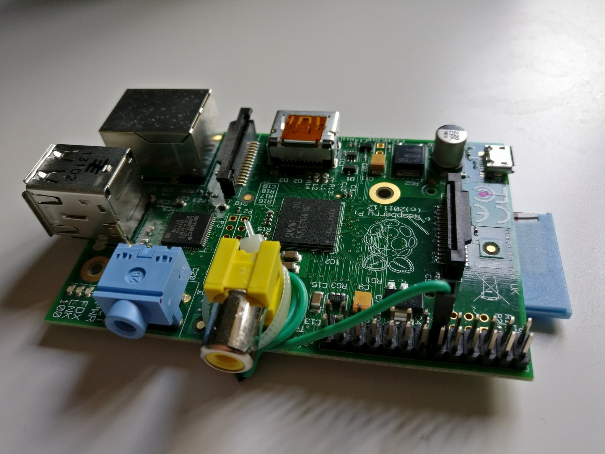
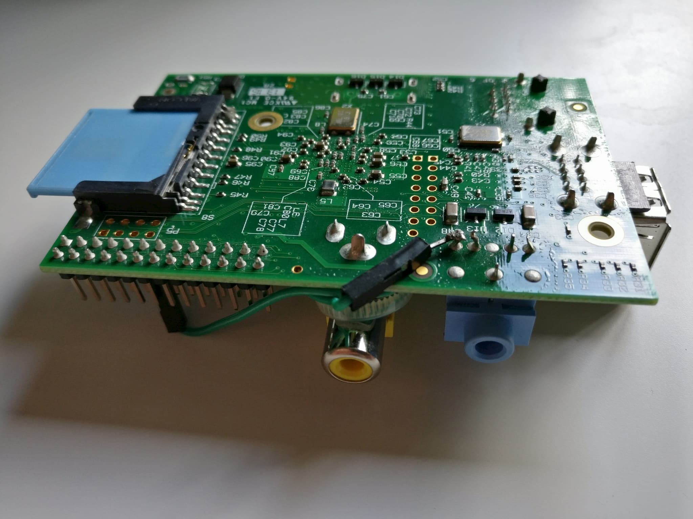

# Connecting a Raspberry Pi to an Onkyo Receiver via RI

The Onkyo RI cable is a simple mono 3.5 audio jack cable. The tip of the connector carries the signal and the shaft is used as ground.

There are two ways to connect a Raspberry Pi to an Onkyo Receiver. Either with an audio jack connector breakout or with the built-in audio jack directly on the Raspberry Pi. This guide uses the latter. If you want to use the audio jack for actual audio, you **must use** a separate break-out!

 Front                             | Back
:---------------------------------:|:-----------------------------------:
  | 

This setup uses a simple GPIO jumper cable and connects it to the soldering point of the audio jack that carries the signal from the tip. The images show a rather old Raspberry Pi model, so you should test which of the soldering points is the right one. You can do this by plugging a cable into the audio jack and testing for a short circuit. Hold one of the measuring tips of a multimeter to the tip of the connector on the other side of the cable and connect the other measuring tip with the individual soldering points on the back of the Raspberry Pi. Once you found the short circuit you know which soldering point to connect to one of your GPIOs.

Once you’ve done you can use onkyrimote with your selected GPIO! Just be sure to remove the jumper cable in case you want to use audio through the audio jack 😉.
